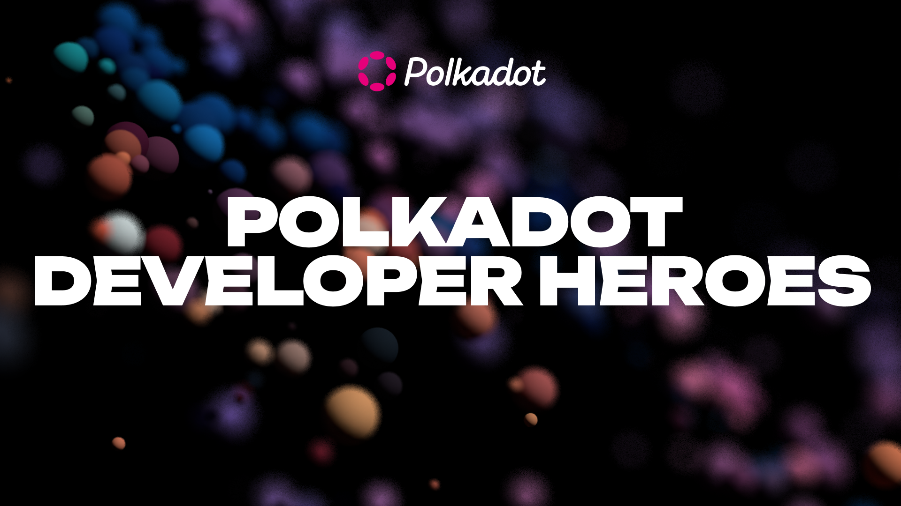

Polkadot is uniting a growing ecosystem around the shared mission of building a better web, and in the past few years has attracted a vibrant community of developers who are constantly pushing the boundaries of what is possible in Web3. Building upon this momentum is the new Polkadot Developer Heroes Program.

This program aims to give more power to Polkadot developers and unlock their potential, to ask for and provide more help while improving their skills, to grow and evolve in their career and passion and to build an even stronger community.

[Sign up to become a candidate!](https://info.polkadot.network/polkadot-developer-heroes?ref=cms.polkadot.network)

## Table of Conetents

- [What is the program?](#what-is-the-program)
- [How to become a Polkadot Developer Hero?](#how-to-become-a-polkadot-developer-hero)
  - [Self-Nomination as a Hero](#self-nomination-as-a-hero)
- [Code of Conduct](#code-of-conduct)
- [License](#license)

## What is the program?

*From the [Polkadot Wiki](https://wiki.polkadot.network/docs/dev-heroes):*

The goal of the Heroes program is to build a strong community of Polkadot developers of different levels of expertise to drive the growth and evolution of the Polkadot ecosystem. Developers need to have some degree of experience with the Polkadot technology stack.

The program provides:

* Opportunities for personal and professional growth.
* Resources and support to boost the growth and evolution of developers.
* Chance to showcase and enhance skills.
* Establish yourself as a valued contributor to the Polkadot ecosystem and pull someone else up on stage at the same time. Each one, teach one!

### Rookies and Heroes

*From the [Polkadot Wiki](https://wiki.polkadot.network/docs/dev-heroes):*

A rookie is a beginner or first-timer developer. Someone who has previous experience in programming but needs to gain in-depth knowledge about the Polkadot technology.

The technology includes but is not limited to independent [Substrate](https://wiki.polkadot.network/docs/glossary#substrate) chains and [ink! development](https://wiki.polkadot.network/docs/build-smart-contracts#ink), and Polkadot-related tooling. Rookies will need to learn these concepts and tools so that they can deliver the tasks required to be a Hero.

A rookie becomes a hero by continuously advocating for the technology used in the Polkadot ecosystem as well as spreading awareness and educating a broader audience about the technology.

Depending on what you enjoy doing, you can become a hero by doing some of the following things:

* Offer mentoring: Offer 1:1 or group mentoring to fellow community members.

* Help out in the community forums: Answer questions from the community on the [Substrate and Polkadot StackExchange](https://substrate.stackexchange.com) or on the [Polkadot Forum](https://forum.polkadot.network).

* Contribute to the Polkadot stack: Have a look at the [open source technology stack list](https://wiki.polkadot.network/docs/build-open-source) and contribute with a pull request, an issue, or find and fix bugs.

* Create content: Write a blog post, record a video tutorial, and write a Twitter thread. Share about your latest coding success, something you learned and are excited about.

* Speak at events: Do a workshop or talk at meetups and conferences.

## How to become a Polkadot Developer Hero?

To register your interest in joining the program, fill out the sign up form [here](https://info.polkadot.network/polkadot-developer-heroes?ref=cms.polkadot.network). You will be contacted by a member of the team to discuss your application and next steps after an initial review.

In the meantime, you can see who are the current [Rookies](Members/Rookies/README.md) and [Heroes](Members/Heroes/README.md) listed in this repository!

### Self-Nomination as a Hero

If you are already a member of the program and would like to nominate yourself as a Hero, please review the [Heroes Application Review Criteria and Scoring Matrix Guidelines](Heroes_Review_Criteria.md) and then create a new issue in this repository using the Hero Self-Nomination Template.

Once your self-nomination has been submitted as an Issue in this repository, the team will be assigned to review your candidacy for Hero status.

## Code of Conduct

This program is guided by a Code of Conduct applicable to all members of the program. You can find the Code of Conduct [here](CODE_OF_CONDUCT.md) along with instructions on how to report violations.

## License

This repository is licensed under the [MIT](LICENSE).