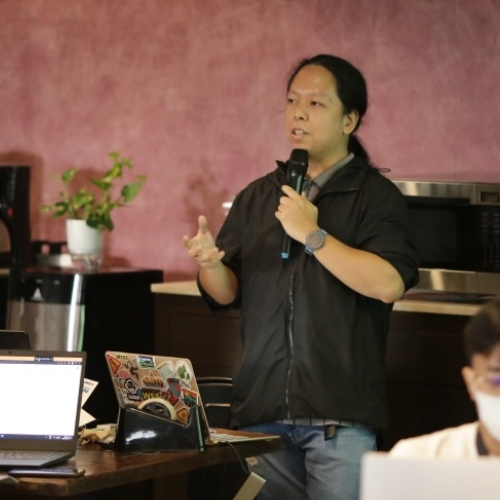
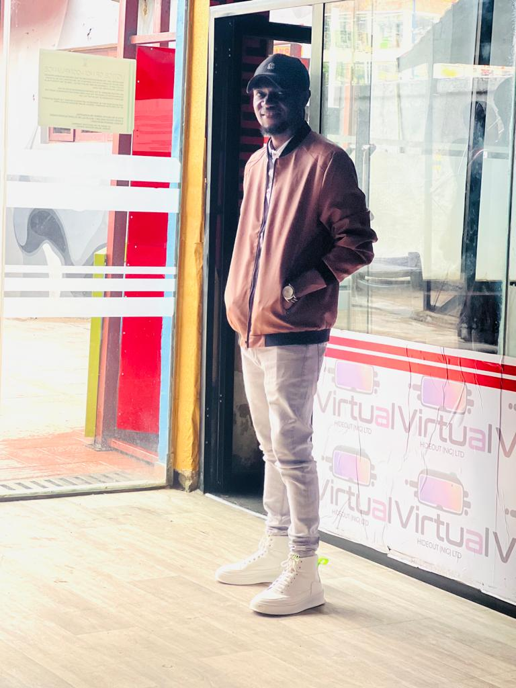

# Rookies

This README showcases all the people who have made it as Rookies into the Heroes program!

All of our program members start as a Rookie. Start by adding your profile as a Rookie to begin with and then be sure to [nominate yourself to be a Hero](https://github.com/Polkadot-Heroes/Members/issues/new/choose) when you feel ready.

You can read the [Heroes Review Criteria and Scoring Matrix Guidelines](../Heroes_Review_Criteria.md) to learn more about the Hero review process.

## Rookies List

### Adel Arja


- Name: Adel Arja
- Position: Blockchain Engineer at [Pendulum](https://pendulumchain.org/)
- GitHub Profile: [adelarja](https://github.com/adelarja)
- Social Media Links:
  - Discord: `adelarja#8195`
  - Telegram: `@adelarja`
  - Element: `@adelarja:matrix.org`
  - LinkedIn: [Adel Arja](https://www.linkedin.com/in/adel-arja-68001158/)

### Adrian Montero


- Name: Adrian Montero
- Position: PhD Student in Computational Physics
- GitHub Profile: [A-mont](https://github.com/A-mont)
- Social Media Links:
  - Discord: `a_mont`
  - Telegram: `@A-mont`
  - Element: `@amont24:matrix.org`
  - LinkedIn: [A-mont](https://www.linkedin.com/in/adri%C3%A1n-montero-312520248/)

### Alessio Giannini


- Name: Alessio Giannini
- Position: Full Stack Developer at [MainProject](https://www.mainproject.it/)
- GitHub Profile: [aleGiannini](https://github.com/aleGiannini)
- Social Media Links:
  - Discord: `alessiog1ann1n1`
  - Telegram: `@ThePr1nce99`
  - Element: `@aless10:matrix.org`
  - E-mail: `alessiogiannini99@gmail.com`
  - LinkedIn: [Alessio Giannini](https://www.linkedin.com/in/alessio-giannini-973787173/)

### Andrew Arutiunian


- Name: Andrew Arutiunian
- Position: CS Student
- GitHub Profile: [siguint](https://github.com/siguint)
- Social Media Links:
  - Discord: `siguint`
  - Telegram: `@siguint`
  - E-mail: `andrew.arutiunian@gmail.com`

### Chinedu E. Nwadike


- Name: Chinedu E. Nwadike
- Position: Software Engineer
- Github Profile: [cenwadike](https://github.com/cenwadike)
- Social Media Links:
  - Discord: `kombi#0548`
  - Telegram: `@kombi16`
  - E-mail: `chinedunwadike04@gmail.com`
  - Linkedin: [Chinedu Emmanuel Nwadike](https://www.linkedin.com/in/cenwadike)

### Chengcheng Shi


- Name: Chengcheng Shi
- Position: Blockchain Engineer
- GitHub Profile: [Chengcheng-S](https://github.com/Chengcheng-S)
- Social Media Links:
  - Discord: `cheng_shi`
  - Telegram: `@shi_chengc`
  - LinkedIn: [师琤琤](https://www.linkedin.com/in/%E7%90%A4%E7%90%A4-%E5%B8%88-b64586269/)

### Fenn Ignatius Saji


- Name: Fenn Ignatius Saji
- Position: Lead Blockchain Developer
- GitHub Profile: [https://github.com/fennsaji](https://github.com/fennsaji)
- Social Media Links:
  - X: [https://twitter.com/fenn_saji](https://twitter.com/fenn_saji)
  - LinkedIn: [https://www.linkedin.com/in/fennsaji/](https://www.linkedin.com/in/fennsaji/)

### Frank Dierolf


- Name: Frank Dierolf
- Position: Web3AR Developer
- GitHub Profile: [Frank Bevr](https://github.com/frankbevr)
- Social Media Links:
  - Discord: `FrankBevr`
  - Telegram: `@FrankBevr`
  - E-mail: `frank_dierolf@web.de`

### Gianluigi Davassi


- Name: Gianluigi Davassi
- Position: Tech Enterpreneur and Software Developer
- GitHub Profile: [Gianluigi Davassi](https://github.com/davassi)
- Social Media Links:
  - LinkedIn: [https://www.linkedin.com/in/gianluigidavassi/](https://www.linkedin.com/in/gianluigidavassi/)
  - E-mail: `gianluigi@honos.finance`

### John Rhodel Bartolome


- Name: John Rhodel Bartolome
- Position: Substrate/Ink Apprentice
- GitHub Profile: [https://github.com/johnrhodel](https://github.com/johnrhodel)
- Social Media Links:
  - X: [https://twitter.com/parachainboy](https://twitter.com/parachainboy)
  - LinkedIn: [https://www.linkedin.com/in/johnrhodel/?locale=en_US](https://www.linkedin.com/in/johnrhodel/?locale=en_US)
  - Discord: `johnrhodel`
  - Telegram: `@parachainboy`
  - E-mail: `johnrhodelbartolome@gmail.com`
- Youtube: [https://www.youtube.com/@vdscripto](https://www.youtube.com/@vdscripto)
- Blog: [https://medium.com/@verbodasabedoria](https://medium.com/@verbodasabedoria)

### Luke Schoen


- Name: Luke Schoen
- Position: Substrate/ink! developer
- GitHub Profile: [ltfschoen](https://github.com/ltfschoen)
- Social Media Links:
  - X: [https://twitter.com/ltfschoen](https://twitter.com/ltfschoen)
  - LinkedIn: [https://www.linkedin.com/in/ltfschoen](https://www.linkedin.com/in/ltfschoen/)

### Mark Hugh Neri


- Name: Mark Hugh Neri
- Position: Blockchain Developer & CTO at The BLOKC
- GitHub Profile: [kimerran](https://github.com/kimerran)
- Social Media Links:
  - Discord: `k1merran`
  - X: [https://twitter.com/k1merran](https://twitter.com/k1merran)
  - E-mail: `mark@theblokc.com`
  - Personal: [https://link.theblokc.com/mh](https://link.theblokc.com/mh)

### Matias Zabala


- Name: Matias Zabala
- Position: Front End Developer
- GitHub Profile: [https://github.com/0xMatiz](https://github.com/0xMatiz)
- Social Media Links:
  - Telegram: `@OxMatiz`
  - X: [https://twitter.com/0xMatiz\_](https://twitter.com/0xMatiz_)
  - Linkedin: [https://www.linkedin.com/in/matias-zabala/](https://www.linkedin.com/in/matias-zabala/)

### Oliver


- Name: Oliver Lim
- Position: Rust/Substrate developer
- GitHub Profile: [https://github.com/cute0laf](https://github.com/fennsaji)
- Social Media Links:
  - Discord: `cute0laf`
  - Telegram: `@cuteolaf`
  - E-mail: `oliverlim818@gmail.com`
  - Linkedin: [https://www.linkedin.com/in/oliver-lim-2215a8235](https://www.linkedin.com/in/oliver-lim-2215a8235)

### Raphael Nembhard


- Name: Raphael Nembhard
- Postion: Blockchain Engineer & Security Researcher
- GitHub Profile: [DeluxeRaph](https://github.com/DeluxeRaph)
- Social Media Links:
  - Twitter: `@VillageFarmerr`
  - Discord: `VillagerFarmer`
  - LinkedIn: [Raphael Nembhard](https://www.linkedin.com/in/raphael-nembhard-701b41180)

### Salil Dinesh Apte


- Name: Salil
- Position: Substrate Developer
- GitHub Profile: [https://github.com/pallasite99](https://github.com/pallasite99)
- Social Media Links:
  - X: [https://twitter.com/pallasite99](https://twitter.com/pallasite99)
  - LinkedIn: [https://www.linkedin.com/in/salil-apte](https://www.linkedin.com/in/salil-apte)
- Personal Site: [https://salil-apte.my.canva.site/](https://salil-apte.my.canva.site/)
- Blog: [https://medium.com/@salilapte](https://medium.com/@salilapte)

### Suraj Vijayan


- Name: Suraj Vijayan
- Position: Full Stack Developer (Js, Rust) | Undergraduate (CSE)
- GitHub Profile: [its-me-sv](https://github.com/its-me-sv)
- Social Media Links:
  - X: [surajvijay67](https://twitter.com/surajvijay67)
  - LinkedIn: [Suraj Vijay](https://www.linkedin.com/in/suraj-vijay-32b679224)
- Personal Site: [surajvijayan.me](https://surajvijayan.me)
- Blog: [surajvijay@hashnode](https://surajvijay.hashnode.dev)

### Tugwa Chinenye Victor


- Name: Tugwa Victor Chinenye
- Position: Fullstack Developer
- Github Profile: [Vickysnipe] (https://github.com/Vickysnipe)
- Social Media Links:
  - X: [Vickysnipes147] (https://twitter.com/vickysnipes147)
  - LinkedIn: [Victor Chinenye Tugwa] (https://www.linkedin.com/in/victor-tugwa-a26a68105/)
  - Discord: [vickysnipe]

### Usama Ali


- Name: Usama Ali
- Position: Rust Substrate Developer
- Github Profile: [Ali-Usama](https://github.com/ali-usama)
- Social Media Links:
  - Discord: `bug_whisperer`
  - Linkedin: [aliusama](https://www.linkedin.com/in/aliusama14/)

### Winnie Ndung'u


- Name: Winnie Ndung'u
- Position: Software Engineer
- Github Profile: [nyambura00](https://github.com/nyambura00)
- Social Media Links:
  - Discord: `nyambura00`
  - Linkedin: [Winnie Ndung'u](https://www.linkedin.com/in/winnie-nyambura/)


## Contributing

To add your profile to our list of Rookies or Heroes, please follow the steps below, please only do so once you receive an invitation after acceptance into the program:

### Fork the Repository

Start by clicking on the "Fork" button at the top right corner of this repository. This will create a copy of this repository in your account.

### Clone the Repository

Now, clone this repository to your machine. Go to your GitHub account, open the forked repository, click on the code button and then click the 'copy to clipboard' icon.

Open a terminal and run the following git command:

```bash
git clone "url you just copied"
```

Change to the repository directory on your computer:

```bash
cd [repository name]
```

Now create a branch using the git checkout command:

```bash
git checkout -b your-new-branch-name
```

### Add your Profile Card

Create your profile card in the appropriate `README.md` file (either `Rookies/README.md` or `Heroes/README.md`), following the provided template or copy and paste an earlier profile card of another member to use for reference. Make sure your profile is in alphabetical order in the list.

Add your profile image to the `./images folder`, and fill out the information fields in your card.

Don't forget to preview your additions in the `README.md` file to confirm it looks as expected.

### Commit your Changes

If you go to the project directory and execute the command git status, you'll see the changes.

Add those changes to the branch you just created using the git add command:

```bash
git add -p
```

Now commit those changes using the git commit command:

```bash
git commit -m "Add [Your Name] to Rookie (or Hero) list"
```

### Push changes to GitHub

Push your changes using the command `git push`:

```bash
git push origin <add-your-branch-name>
```

### Submit your Changes for Review

If you go to your repository on GitHub, you'll see a Compare & pull request button. Click on that button.

Now submit the pull request, ensuring you use the provided PR template (either Rookie or Hero).

Once your pull request is merged, your profile will be visible in the list!

## License

This project is licensed under the terms of the MIT license. Please see [LICENSE](../LICENSE) for more details.
